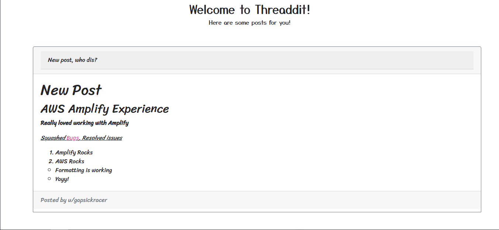

<h1></img> Threaddit</h1>

<i><h3>Your place to share!</h3></i>

# Project Description

### Inspiration

Threaddit is your place to share thoughts, and interact with your friends! The inspiration behind this idea comes from the master of communities, Reddit. We wanted to create a single-threaded forum, where people can share their thoughts and display them in richtext formats.

### What it does

Threaddit is a single-threaded chat forum where users can share their thoughts and ideas to the world, all in one thread and they can shape their ideas by formatting them in richtext. Threaddit can render their richtexts in the homepage, in real-time. Threaddit provides a safe place to interact by avoiding spam through Amazon Cognito user verification service.

### How we built it

Threaddit uses AWS Amplify for the backend of the application. AWS Amplify provides services essential for the Threaddit experience, ranging from Amazon Cognito providing user authentication. AWS DynamoDB provided database storage to AWS AppSync, providing GraphQL APIs to query and mutate with new user data. FOr storing and displaying Ricktext previews, Threaddit uses Slate.js under the hood. Threaddit is built upon React written in TypeScript.

### Challenges we ran into

Working on Threaddit has been an absolutely wonderful experience, although we did run into challenges. Setting up the Amplify backend needed some research and scouting. Slate.js also posed some bugs which we were to solve after a long pair coding session.

### Accomplishments that we're proud of

Using AWS Amplify successfully and using their AppSync GraphQL APIs was a huge achievement the team achieved. Other than that, finishing the MVP within the time was an accomplishment we are proud of.

### What we learned

A lot actually! It was a wonderful experience working with the AWS Amplify service and using Slate.js to store and render richtext previews. Our React concepts were strengthened, and TypeScript was there to help us throughout our learning journey.

### What's next for Threaddit

We plan to expand Threaddit to include a commenting system, which we could not do due to time constraints. Searching and filtering posts by a user, topic, date or time could also be implemented.

# Screenshots:

### Home Page:

### Login/Signup Page

### Create a new Post:

### Single-thread View:

### Expanded Richtext Preview:

