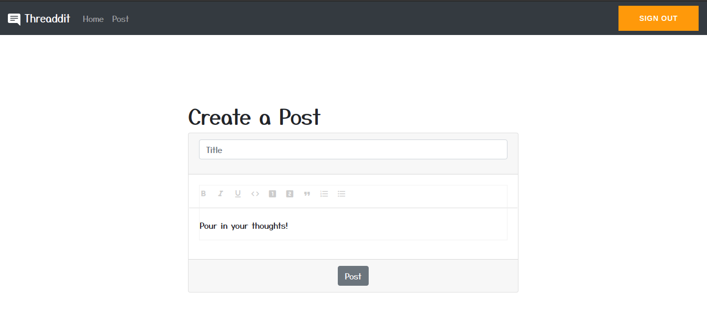
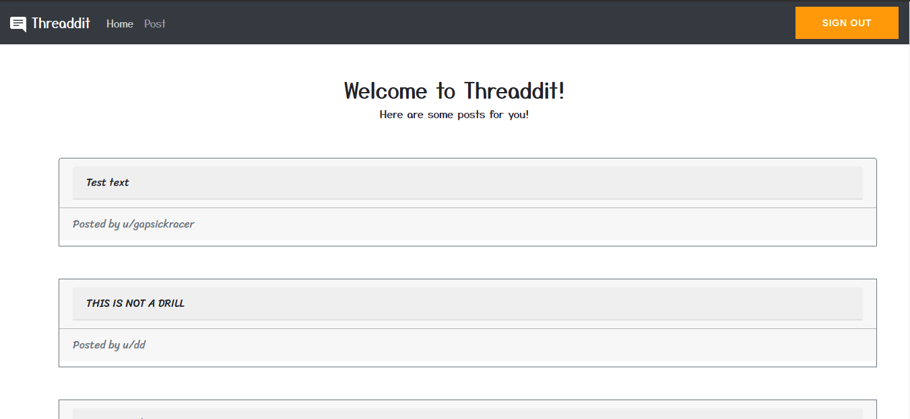

<h1><svg xmlns="http://www.w3.org/2000/svg" width="24" height="24" fill="currentColor" class="bi bi-chat-right-text-fill" viewBox="0 0 16 16">
  <path d="M16 2a2 2 0 0 0-2-2H2a2 2 0 0 0-2 2v8a2 2 0 0 0 2 2h9.586a1 1 0 0 1 .707.293l2.853 2.853a.5.5 0 0 0 .854-.353V2zM3.5 3h9a.5.5 0 0 1 0 1h-9a.5.5 0 0 1 0-1zm0 2.5h9a.5.5 0 0 1 0 1h-9a.5.5 0 0 1 0-1zm0 2.5h5a.5.5 0 0 1 0 1h-5a.5.5 0 0 1 0-1z"/>
</svg> Threaddit</h1>

<i><h3>Your place to share!</h3></i>

# Screenshots:

### Home Page:

### Create a new Post:

### Threads View Page:

